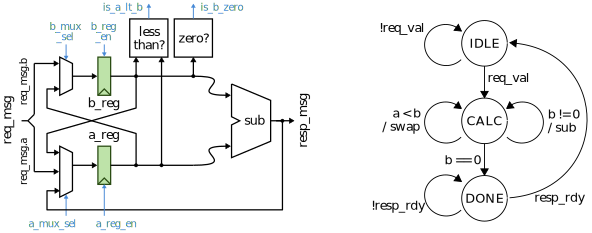

Quick Start
==========================================================================

This repo includes a small Verilog design that computes a greatest common
divisor function. The datapath includes two state registers and the
required muxing and arithmetic units to iteratively implement Euclid's
algorithm. You can use this design to demo the default ASIC flow that
ships with mflowgen, which should work for most designs.

**Greatest Common Divisor Circuit (GcdUnit)**

This section steps through how to clone the repo and push this design
through synthesis, place, and route with the included open-source 45nm
ASIC design kit using either the open-source tools (e.g., Yosys) or the
commercial tools (i.e., Synopsys, Cadence, Mentor).

You may want to work in a virtual environment:

.. code:: bash

    % python3 -m venv venv
    % source venv/bin/activate

First, clone the repo:

.. code:: bash

    % git clone https://github.com/mflowgen/mflowgen
    % cd mflowgen
    % TOP=${PWD}

Install mflowgen with pip as an editable repo:

.. code:: bash

    % pip install -e .

The greatest common divisor design has three demo graphs in
``$TOP/designs/GcdUnit``:

1. ``construct-open.py`` -- Open-source toolflow based on Yosys,
   graywolf, qrouter, and RePlAcE

2. ``construct-commercial.py`` -- Commercial toolflow based on
   Synopsys, Cadence, and Mentor tools

3. ``construct-commercial-full.py`` -- Commercial toolflow with more nodes
   expanded for greater observability

All three flows use the 45nm ASIC design kit based on FreePDK45 and the
NanGate Open Cell Library.

.. note::

    To switch between the different graphs, open
    ``$TOP/designs/GcdUnit/.mflowgen.yml`` and specify one of the three
    choices. The remainder of this quickstart will assume you have modified
    this file and chosen the open-source toolflow.

    Refer to :ref:`quick_start_commercial` for a similar quick start that
    uses commercial tools (e.g., Synopsys, Cadence, Mentor) instead of
    open-source tools.

.. code:: bash

    % cd $TOP
    % mkdir build && cd build
    % mflowgen run --design ../designs/GcdUnit

You can show information about the currently configured flow:

.. code:: bash

    % make info      # <-- shows which design is being targeted
    % make list      # <-- shows most things you can do
    % make status    # <-- prints the build status of each node
    % make graph     # <-- dumps a graphviz PDF of the configured flow

Now run synthesis and check the outputs of the sandbox to inspect
the area report. **Note**: For the commercial flow, check ``make
list`` for the build target name.

.. code:: bash

    % make open-yosys-synthesis
    % cat *-open-yosys-synthesis/outputs/synth.stats.txt

You can also run nodes using the number from ``make list``:

.. code:: bash

    % make list      # <-- 3 : open-yosys-synthesis
    % make 3

The yosys area report will look something like this:

.. code::

    === GcdUnit ===

       Number of wires:                406
       Number of wire bits:           1011
       Number of public wires:         406
       Number of public wire bits:    1011
       Number of memories:               0
       Number of memory bits:            0
       Number of processes:              0
       Number of cells:                941
         AOI211_X1                       3
         AOI21_X1                       34
         AOI22_X1                       30
         BUF_X1                        626
         CLKBUF_X1                       5
         DFF_X1                         34
         INV_X1                         48
         NAND2_X1                       42
         NAND3_X1                        3
         NOR2_X1                        34
         NOR3_X1                         3
         NOR4_X1                         4
         OAI211_X1                       1
         OAI21_X1                       40
         OAI221_X1                       1
         OAI22_X1                        2
         OR2_X1                          1
         XNOR2_X1                       18
         XOR2_X1                        12

       Chip area for this module: 932.330000

Report run times to check how long each node has taken:

.. code:: bash

    % make runtimes

Then run place-and-route (requires graywolf and qrouter):

.. code:: bash

    % make open-graywolf-place
    % make open-qrouter-route

