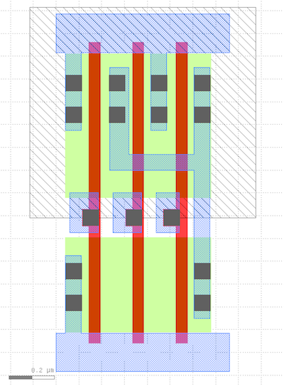

FreePDK45 and the Nangate Open Cell Library
==========================================================================

The FreePDK45 kit is an open-source generic process design kit (PDK) (i.e.,
does not correspond to any real process and cannot be fabricated) that allows
researchers and students to experiment with designing in a modern technology
node without signing restrictive non-disclosure agreements or paying for
licenses. The PDK allows you to use commercial full-custom layout tools (e.g.,
Cadence Virtuoso) to design both analog and digital circuits. Later in our
flow, we will be leveraging the Calibre design-rule check (DRC) and
layout-vs-schematic (LVS) rule decks that come with the FreePDK45 kit to verify
our design. You can find more details about FreePDK45 `here
<https://www.eda.ncsu.edu/wiki/FreePDK45:Contents>`__.

Digital synthesis tools work with libraries of pre-drawn and pre-characterized
standard cells (often provided by IP vendors like ARM). The Nangate Open Cell
Library is a generic open-source digital standard-cell library designed using
the FreePDK45 kit. For example, here is the layout for a NAND_X3 standard
cell:

You can see the VDD rail (blue strip at the top), the VSS rail (blue strip at
the bottom), the poly (red vertical strips), contacts (dark blue squares), and
input pins on M1 (three dark blue squares that connect to the poly gates). The
physical database containing these layout shapes is known as a graphic database
system (GDS) and can be found in "stdcells.gds" in the base kit `here
<https://github.com/mflowgen/mflowgen/tree/master/adks/freepdk-45nm/pkgs/base>`__.

Each cell in the library is characterized with a large number of SPICE
simulations and the timing information is captured in the "stdcells.lib" and
"stdcells.db" files (the same information is captured in both, just different
file formats). You can find more details about this library `here
<https://projects.si2.org/openeda.si2.org/help/group_ld.php?group=63>`__. The
liberty (.lib) file is human-readable and you can directly read it in the base
kit `here
<https://github.com/mflowgen/mflowgen/blob/master/adks/freepdk-45nm/pkgs/base/stdcells.lib>`__.

The Nangate library also comes with the routing technology kit (RTK) technology
LEF, often called the "tech LEF". This describes all available layers that the
synthesis and place-and-route tools can use for routing. This file is also
human-readable and you can read it in the base kit `here
<https://github.com/mflowgen/mflowgen/blob/master/adks/freepdk-45nm/pkgs/base/rtk-tech.lef>`__.
For example, the "metal1" parameters look like this:

.. code::

    LAYER metal1
      TYPE ROUTING ;
      SPACING 0.065 ;
      WIDTH 0.07 ;
      PITCH 0.14 ;
      DIRECTION HORIZONTAL ;
      OFFSET 0.095 0.07 ;
      RESISTANCE RPERSQ 0.38 ;
      THICKNESS 0.13 ;
      HEIGHT 0.37 ;
      CAPACITANCE CPERSQDIST 7.7161e-05 ;
      EDGECAPACITANCE 2.7365e-05 ;
    END metal1

