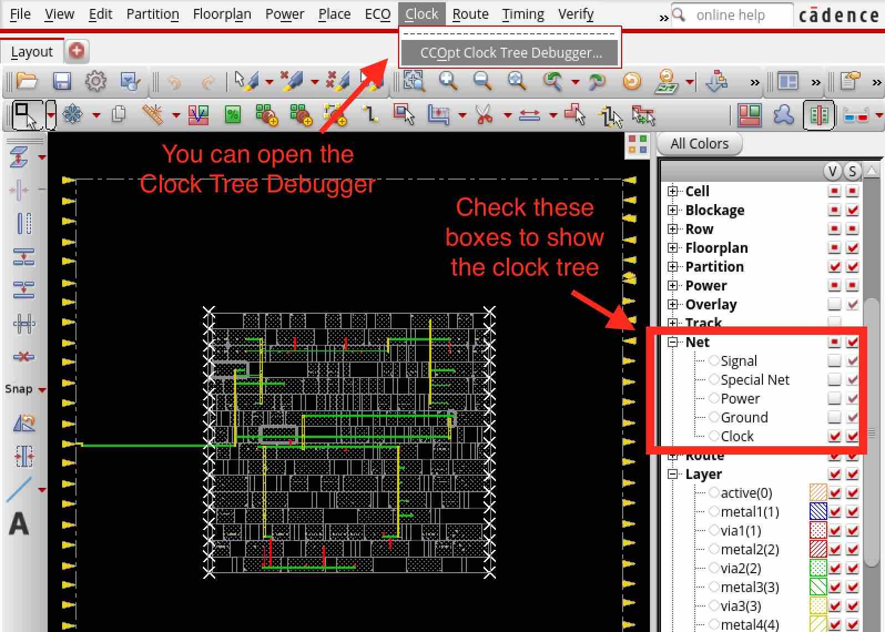
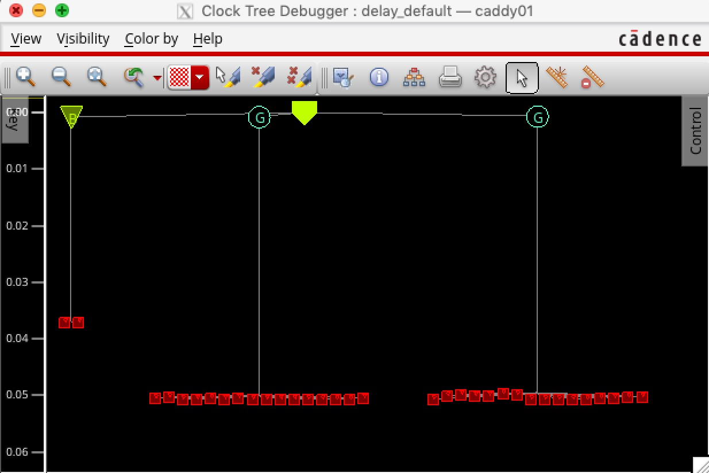

Clock Tree Synthesis
==========================================================================

The next step is clock tree synthesis (i.e., the ``cadence-innovus-cts``
node), which skew-balances the clock tree. You can run the design up to
this node like this:

.. code:: bash

    % cd $top/build
    % make cadence-innovus-cts

Here are the inputs, outputs, and scripts and what they do. Again, you
should not need to change any of these.

+--------+--------------------+---------------------------------------------------------+
| input  | design.checkpoint  | The working Innovus database from the previous node.    |
+--------+--------------------+---------------------------------------------------------+
| output | design.checkpoint  | The working Innovus database after the node finishes.   |
+--------+--------------------+---------------------------------------------------------+
| script | setup-ccopt.tcl    | These are options for clock tree optimization that you  |
|        |                    | will probably not need to touch.                        |
+--------+--------------------+---------------------------------------------------------+
| script | main.tcl           | Calls the Innovus Foundation Flow script.               |
+--------+--------------------+---------------------------------------------------------+

Here is a list of checks you will want to run through before moving on to the next step:

- Look at the clock tree in the GUI -- You can check boxes in the right
  panel of the GUI to show just the clock tree. This can give you a good
  visual sense of how the clock is being distributed. Notice how the clock
  enters from the middle pin of the left side in the GcdUnit layout. If
  your clock pin was placed in an odd corner during floorplanning, it
  could affect your clock tree.

- Look at the clock tree debugger in the GUI -- Open the ``Clock Tree
  Debugger`` to see a tree of all clock gates, buffers, and sinks in your
  design. The y-scale is the clock insertion delay for that cell (i.e.,
  how long it takes for the clock to propagate from the pin to that cell).

