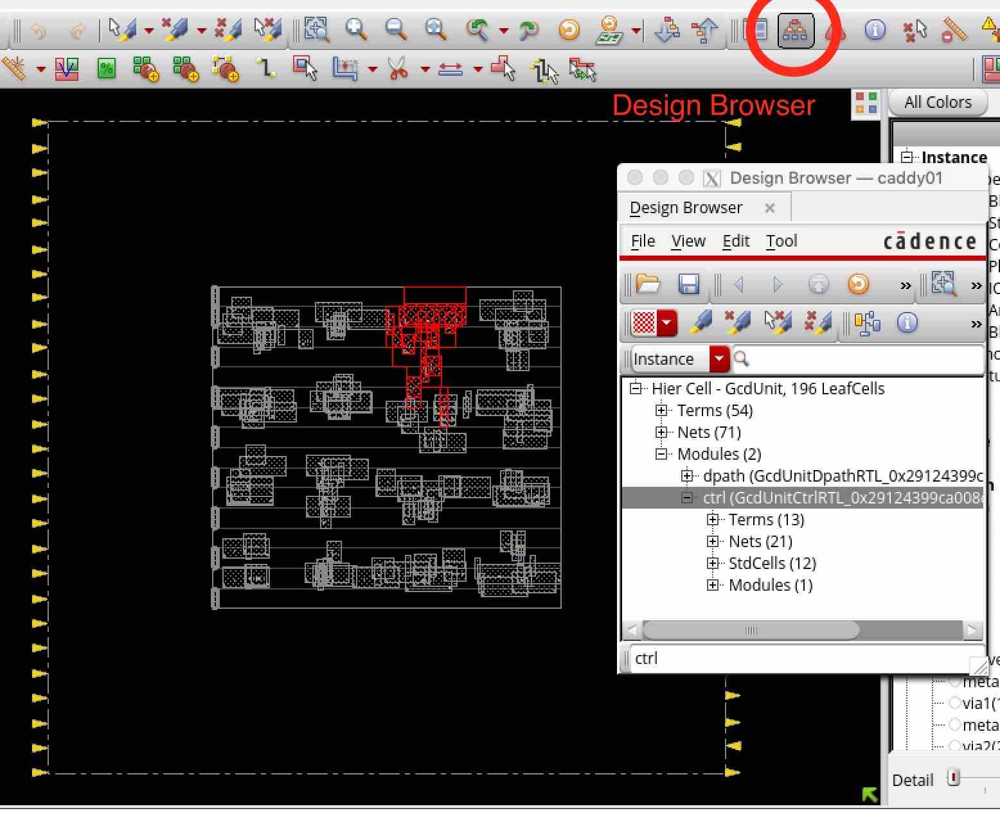

Design Initialization and Floorplanning
==========================================================================

The first step during place and route is called ``init`` (i.e., the
``cadence-innovus-init`` node) and reads in the design from synthesis
before executing floorplanning. You can run the design up to the init node
like this:

.. code:: bash

    % cd $top/build
    % make cadence-innovus-init

Refer back to :ref:`innovus_submodularization` to see what the inputs, outputs,
and scripts are and what they do. Here is a list of scripts you might
tweak at this step:

- :download:`floorplan.tcl
  <../steps/cadence-innovus-init/scripts/floorplan.tcl>` -- This is where
  we size the core area (targeting a certain density) and aspect ratio.
  This is also where we place macros. A reasonable density target is about
  75%, and a very aggressive density is over 90%. Aspect ratios that are
  square are generally preferred over long rectangular ones. Rectangular
  floorplans place more stress on either horizontal or vertical routing
  resources and also make it difficult to place macros. Note that
  ``planDesign`` is the command that automatically places your macros.

- :download:`pin-assignments.tcl
  <../steps/cadence-innovus-init/scripts/pin-assignments.tcl>` -- This is
  where we use the "editPin" command to spread pins along the sides on
  specific metal layers. We could also read a pre-saved io file in this
  script.

- :download:`make-path-groups.tcl
  <../steps/cadence-innovus-init/scripts/make-path-groups.tcl>` -- You can
  create path groups to tell the timing engine to prioritize certain paths
  that you may find more important than others (e.g., paths to macros).
  During timing optimization, the tool loops through each of the path
  groups and tries to fix the worst paths in each group. If there were
  only a single path group, the tool might never work on paths further
  down the list that you as a designer know are important. Enough useful
  path groups have been set for you that you will likely not need to add
  any more.

Here is a list of checks you will want to run through before moving on to
the next step:

- ``reports/preplace.summary.gz`` -- The timing summary report at the end
  of init assumes no wire delays. This means that the timing reports
  should look nearly identical to those from synthesis. Therefore, the
  first thing you should check is that the timing is not be significantly
  better or worse than in synthesis. When wire delays are factored in,
  these numbers will only look worse, so the tool should not be trying too
  hard to meet timing at this point. In particular, there should **never**
  be negative slack in this report.

.. code::

    ------------------------------------------------------------
              timeDesign Summary
    ------------------------------------------------------------

    +--------------------+---------+---------+---------+---------+
    |     Setup mode     |   all   | reg2reg |reg2cgate| default |
    +--------------------+---------+---------+---------+---------+
    |           WNS (ns):|  0.636  |  0.636  |  1.244  |  0.759  |
    |           TNS (ns):|  0.000  |  0.000  |  0.000  |  0.000  |
    |    Violating Paths:|    0    |    0    |    0    |    0    |
    |          All Paths:|   56    |   34    |    2    |   54    |
    +--------------------+---------+---------+---------+---------+
    |analysis_default    |  0.636  |  0.636  |  1.244  |  0.759  |
    |                    |  0.000  |  0.000  |  0.000  |  0.000  |
    |                    |    0    |    0    |    0    |    0    |
    |                    |   56    |   34    |    2    |   54    |
    +--------------------+---------+---------+---------+---------+

    Density: 0.000%

- ``logs/run.log`` -- There should be no errors in the logs. Most possible
  errors at this stage will be related to reading the technology files and
  libraries.

- Check the floorplan in the GUI -- Run the debug target on this node and
  bring up the GUI. GcdUnit does not have any macros, but this is
  generally the time to make sure that the macros are placed at reasonable
  locations and orientations (e.g., pins facing the core area, no narrow
  channels). It can be useful to do a fast prototype of cell placement to
  see what the design will look like with stdcells. A floorplan mode
  placement does this by placing cells while ignoring DRCs for speed:

.. code::

    > setPlaceMode -place_design_floorplan_mode true
    > place_design

- You can also open the ``Design Hierarchy`` viewer and click on a module
  to see where the stdcells in a particular module were placed. For
  example, the control module for GcdUnit was randomly placed in a clump
  near the top in this floorplan-mode prototype placement.

