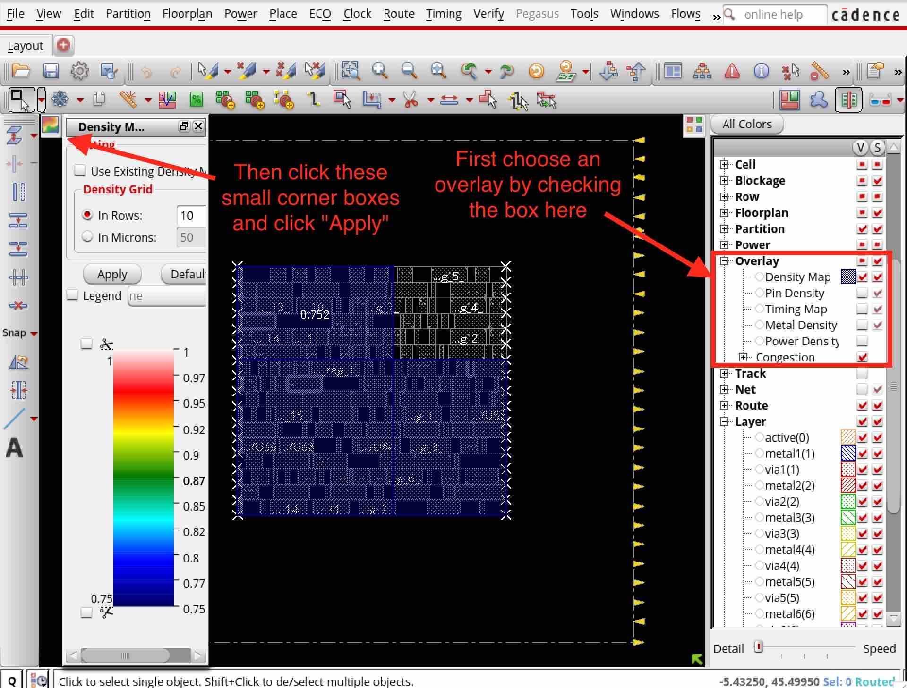

Placement
==========================================================================

The next step is placement (i.e., the ``cadence-innovus-place`` node),
which iterates on different placements with the global router. You can run
the design up to this node like this:

.. code:: bash

    % cd $top/build
    % make cadence-innovus-place

Here are the inputs, outputs, and scripts in the place node and what they
do.

+--------+-------------------------------+---------------------------------------------------------+
| input  | design.checkpoint             | The working Innovus database from the previous node.    |
+--------+-------------------------------+---------------------------------------------------------+
| output | design.checkpoint             | The working Innovus database after the node finishes.   |
+--------+-------------------------------+---------------------------------------------------------+
| script | setup-cellpad.tcl             | Sets up padding next to each DFF to reserve space for   |
|        |                               | buffers during timing optimization. Without padding in  |
|        |                               | very dense designs, there may not be enough space left  |
|        |                               | for timing-fixing buffers.                              |
+--------+-------------------------------+---------------------------------------------------------+
| script | main.tcl                      | Calls the Innovus Foundation Flow script.               |
+--------+-------------------------------+---------------------------------------------------------+
| script | clean-cellpad.tcl             | Removes the padding constraint after placement is over. |
+--------+-------------------------------+---------------------------------------------------------+

Here is a list of checks you will want to run through before moving on to the next step:

- ``reports/place.summary`` -- With wires in place, the timing will be
  worse than it was in init and synthesis. The timing must look good in
  this report. The goal of all future steps is only to *preserve* the
  timing in this report.

- ``logs/run.log`` -- Look for the final congestion analysis table in the
  log. Make sure that the overflows are at most a few percent. If the
  routing tracks are too oversubscribed (across all GCells in the design),
  the resulting congestion will make timing very hard to meet. The table
  below is nearly clean because there is no congestion in GcdUnit.

.. image:: _static/images/stdlib/place-congestion.jpg
  :width: 400px

- Check density and congestion overlays in the GUI -- Open the debug
  target for place. Then enable overlays as shown in the following figure.
  This is a visual version of what you can already find in the logs.

