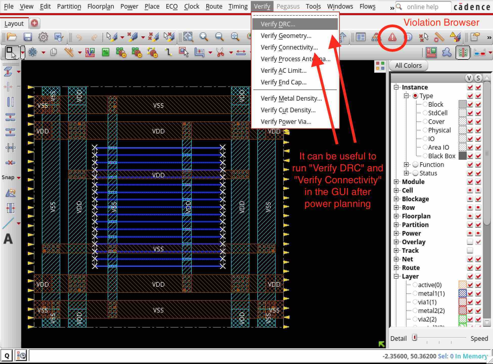
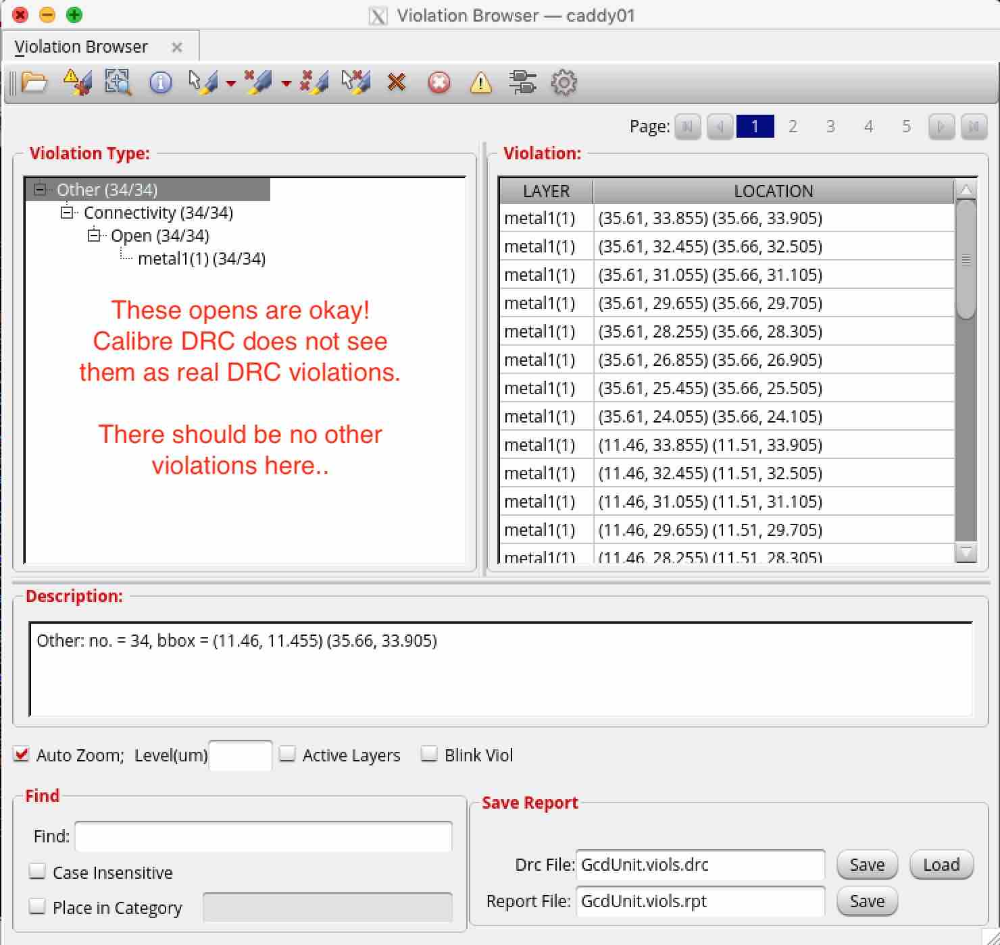

Power Strategy
==========================================================================

The next step is the power strategy (i.e., the ``cadence-innovus-power``
node), which sets up the power rings, stripes, and grid. You can run the
design up to this node like this:

.. code:: bash

    % cd $top/build
    % make cadence-innovus-power

Here is a list of what the defaults inputs, outputs, and scripts are and
what they do:

+--------+-------------------------------+-------------------------------------------------------+
| input  | design.checkpoint             | The working Innovus database from the previous node.  |
+--------+-------------------------------+-------------------------------------------------------+
| output | design.checkpoint             | The working Innovus database after the node finishes. |
+--------+-------------------------------+-------------------------------------------------------+
| script | globalnetconnect.tcl          | Logically connects power nets (e.g., VDD and VSS) to  |
|        |                               | pins on cells in the design, even if their pins are   |
|        |                               | not explicitly called VDD or VSS.                     |
+--------+-------------------------------+-------------------------------------------------------+
| script | main.tcl                      | Main script that calls a power strategy.              |
+--------+-------------------------------+-------------------------------------------------------+
| script | power-strategy-dualmesh.tcl   | Builds a fine mesh on lower metals for di/dt and a    |
|        |                               | coarse mesh on higher metals for IR drop (you will    |
|        |                               | not use this script in 45nm).                         |
+--------+-------------------------------+-------------------------------------------------------+
| script | power-strategy-singlemesh.tcl | Builds a single power mesh on higher metals to        |
|        |                               | minimize IR drop.                                     |
+--------+-------------------------------+-------------------------------------------------------+

To iterate on your power strategy, we highly recommend opening the GUI
(running the debug target for init gives you a clean slate) and
copy-pasting the power commands one by one while tweaking them. You should
press ``U`` to undo if you do not like the result of an addStripe or
addRing command. You can also just type the ``undo`` command. If you want
to start over, you can run the following command to delete power-related
shapes:

.. code::

    > deleteAllPowerPreroutes

At any point in your work, you can run an Innovus DRC which only checks
the shapes that Innovus can see (i.e., wires). After opening ``Verify
DRC`` just accept the default settings. You can also run an Innovus LVS
with ``Verify Connectivity``, although this will always fail at this stage
because the cells and wires do not exist yet which certainly does not
match the source netlist.

The violation browser is the red triangle button and lists all violations
found by these checks. This view should be clear of DRC violations.

