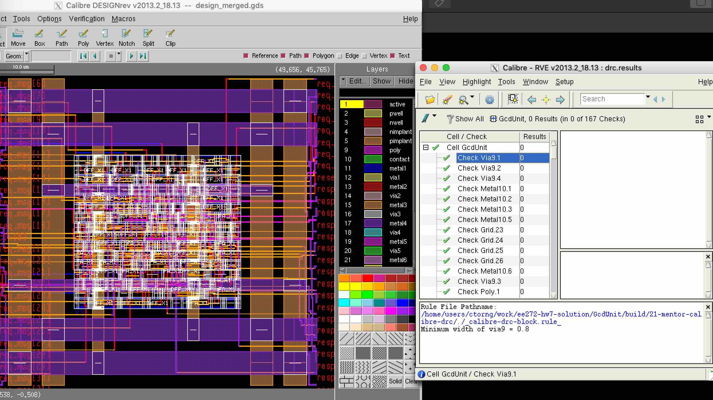

Design Rule Check (DRC)
==========================================================================

Here we run DRC with Mentor Calibre (i.e., the ``mentor-calibre-drc``
node). You can run the design up to this node like this:

.. code:: bash

    % cd $top/build
    % make mentor-calibre-drc

Here are the two inputs to this node:

+--------+-------------------+------------------------------------------------------------------------------+
| input  | design_merged.gds | A merged GDS containing the Innovus GDS, the stdcell GDS, and any macro GDS. |
+--------+-------------------+------------------------------------------------------------------------------+
| input  | adk               | This node uses the Calibre DRC rule deck from the ADK.                       |
+--------+-------------------+------------------------------------------------------------------------------+

You should see zero total results generated at the end of the log from this node:

.. code::

    --- CALIBRE::DRC-H EXECUTIVE MODULE COMPLETED.  CPU TIME = 2  REAL TIME = 1
    --- TOTAL RULECHECKS EXECUTED = 167
    --- TOTAL RESULTS GENERATED = 0 (0)
    --- DRC RESULTS DATABASE FILE = drc.results (ASCII)

If you see any results, open the debug target for this node to bring up
the GDS viewer GUI (Calibre DESIGNrev) and inspect each violation. After
the layout loads, press ``>`` many times to increase the depth and see
inside all the cells. To show layout of macros press Shift + f.

The RVE window will also pop up showing all violations. In this case, DRC
is clean for the GcdUnit. If there are errors, you can right click on the
error and select Highlight, this will highlight the error in the DESIGNrev
GUI. This is usually very zoomed in. You can change zoom from the View
menu or using shortcuts (also shown in the View menu).

