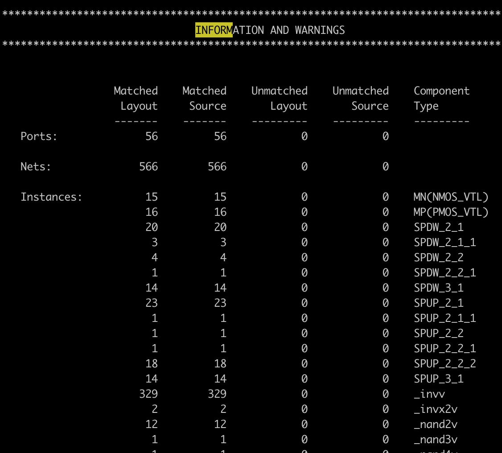

Layout-vs-Schematic (LVS)
==========================================================================

Next we run LVS also with Mentor Calibre (i.e., the ``mentor-calibre-lvs``
node). You can run the design up to this node like this:

.. code:: bash

    % cd $top/build
    % make mentor-calibre-lvs

Here are the inputs, outputs, and scripts and what they do.

+--------+-------------------+-------------------------------------------------------+
| input  | rules.svrf        | An optional file with additional LVS commands to run. |
+--------+-------------------+-------------------------------------------------------+
| input  | design_merged.gds | This must be the same merged GDS that you             |
|        |                   | ran DRC on. The combination of DRC and LVS            |
|        |                   | tells you that the layout is manufacturable           |
|        |                   | (DRC) and that that same layout matches the           |
|        |                   | schematic (LVS) that you run gate-level               |
|        |                   | tests on. If you run DRC and LVS on                   |
|        |                   | different layouts, then this semantic link            |
|        |                   | is broken.                                            |
+--------+-------------------+-------------------------------------------------------+
| input  | design.lvs.v      | The post-place-and-route gate-level netlist with      |
|        |                   | physical-only cells removed.                          |
+--------+-------------------+-------------------------------------------------------+
| input  | adk               | This node uses the Calibre LVS rule deck from the ADK.|
+--------+-------------------+-------------------------------------------------------+

Open the LVS report to check the comparison result:

- ``lvs.report`` -- This will have a smiley face at the top if you pass
  LVS. The most important table to look at in the lvs.report is the
  "Information and Warnings" table part of the way down. This will show
  the number of ports, nets, and devices found in the layout and in the
  source and how the numbers match up.

If you see a mismatch, open the debug target for this node to bring up the
GDS viewer GUI (Calibre DESIGNrev). After the layout loads, press $>$ many
times to increase the depth and see inside all the cells.

Unfortunately, LVS mismatches are very difficult to debug because of how
LVS transforms and squashes transistors together, causing a mismatch in
one place to manifest in another. The debug GUI will still be useful to
list which nets and ports Calibre thinks are missing.

