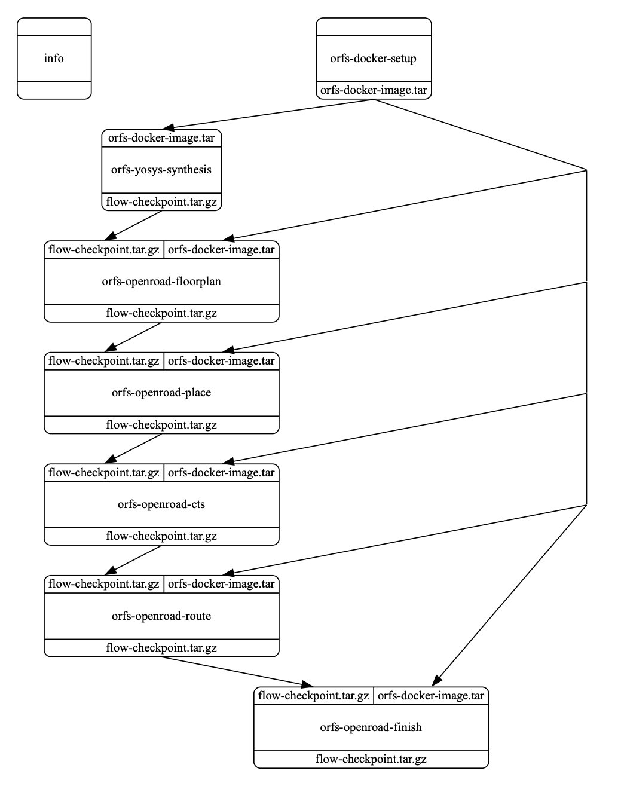
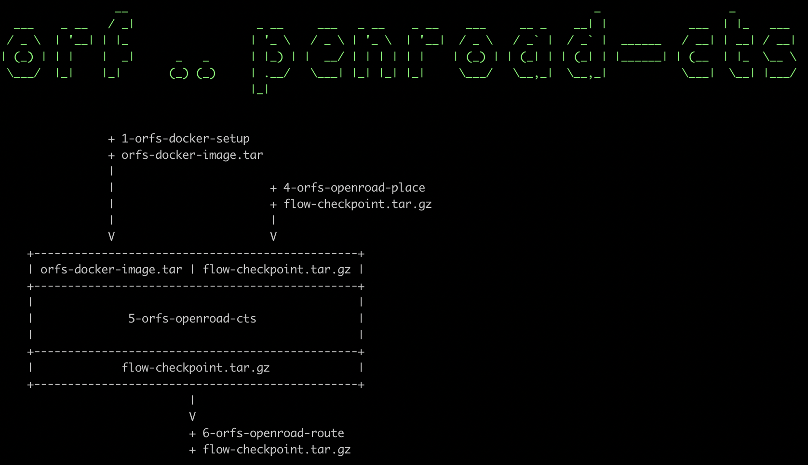

Common Library Nodes -- OpenROAD Flow Scripts
==========================================================================

We are excited to partner with `the OpenROAD Project
<https://theopenroadproject.org>`__ as well as `the OpenROAD Flow Scripts
(ORFS) <https://github.com/The-OpenROAD-Project/OpenROAD-flow-scripts>`__
RTL-GDSII flow for rapid architecture and design space exploration, early
prediction of QoR, and detailed physical design implementation.

The mflowgen common library integrates the following modular nodes that
are based on ORFS and rely only on a ``Docker <https://www.docker.com>`__
installation:

+-----------+-------------------------+------------------------------------------------------------------------------+
| **Tool**  | **Node**                | **Description**                                                              |
+-----------+-------------------------+------------------------------------------------------------------------------+
| Docker    | orfs-docker-setup       | Pulls an image from Docker hub containing the tools and environment for ORFS |
+-----------+-------------------------+------------------------------------------------------------------------------+
| Yosys     | orfs-yosys-synthesis    | Runs synthesis with the open-source Yosys tool to synthesize RTL into gates  |
+-----------+-------------------------+------------------------------------------------------------------------------+
| OpenROAD  | orfs-openroad-floorplan | Floorplans the die/core area, assigns pin placement, macro placement         |
+-----------+-------------------------+------------------------------------------------------------------------------+
| OpenROAD  | orfs-openroad-place     | Global placement with the open-source RePlAce tool and detailed placement    |
+-----------+-------------------------+------------------------------------------------------------------------------+
| OpenROAD  | orfs-openroad-cts       | Clock tree synthesis with the open-source TritonCTS tool                     |
+-----------+-------------------------+------------------------------------------------------------------------------+
| OpenROAD  | orfs-openroad-route     | Routing with the open-source FastRoute and TritonRoute tools                 |
+-----------+-------------------------+------------------------------------------------------------------------------+
| OpenROAD  | orfs-openroad-finish    | Finishing step with the open-source OpenRCX and other tools                  |
+-----------+-------------------------+------------------------------------------------------------------------------+

Refer to the `OpenROAD documentation <https://openroad.readthedocs.io>`__
for more information on the tools.

To experiment with the mflowgen and OpenROAD flow, you can create a new
build using the GcdUnit pipe cleaner as a demo:

    % cd $top
    % mkdir build-openroad && cd build-openroad
    % mflowgen run --design ../designs/GcdUnit/construct-openroad.py

Here is the list of steps:

.. code:: bash

    % make status
     Status:
      - **build** -> 0 : info
      - **build** -> 1 : orfs-docker-setup
      - **build** -> 2 : orfs-yosys-synthesis
      - **build** -> 3 : orfs-openroad-floorplan
      - **build** -> 4 : orfs-openroad-place
      - **build** -> 5 : orfs-openroad-cts
      - **build** -> 6 : orfs-openroad-route
      - **build** -> 7 : orfs-openroad-finish

The basic demo graph can be visualized as well:

.. code:: bash

    % make graph
    % ( ... open graph.pdf ... )

Feel free to cross-check the construct-openroad.py, the graph visualization, and
the `step configuration files
<https://github.com/mflowgen/mflowgen/tree/master/steps>`_ to see which
files are passing between which steps.

The integration uses a base docker image that has the OpenROAD tool
environment installed as a vehicle for executing the tools. The base image
is passed into each of the downstream nodes based on the ORFS flow. You
may also notice that each node consumes and produces flow checkpoint
tarballs, which initialize the flow state in the Docker container before
the node executes. There are no new Docker images produced, which makes
this approach fast and clean, despite being a modular approach that
repeatedly goes in and out of docker containers.

.. code:: bash

    % make info-5  # Inspects the details for node orfs-openroad-cts
    % ( ... open graph.pdf ... )

You can run the entire flow to the end:

.. code:: bash

    % make 7  # See "make status", this corresponds to orfs-openroad-finish

You can then find all of the results in the outputs directory of that
node, specifically in the flow checkpoint tarball. For example,
"7-orfs-openroad-finish/flow/results/nangate45/gcd/base/6_final.gds" has
the final layout:

.. image:: _static/images/stdlib/openroad-demo-layout.jpg
  :width: 400px

Also, note that each node supports debug targets to drop you into the
Docker container shell:

.. code::

    % make debug-7

    root@b11dbe7cd067:/OpenROAD-flow-scripts# ...

The integration of mflowgen with OpenROAD flow scripts will allow mflowgen
users to customize new functionality based on these open-source nodes,
while continuing to track the ORFS upstream.

