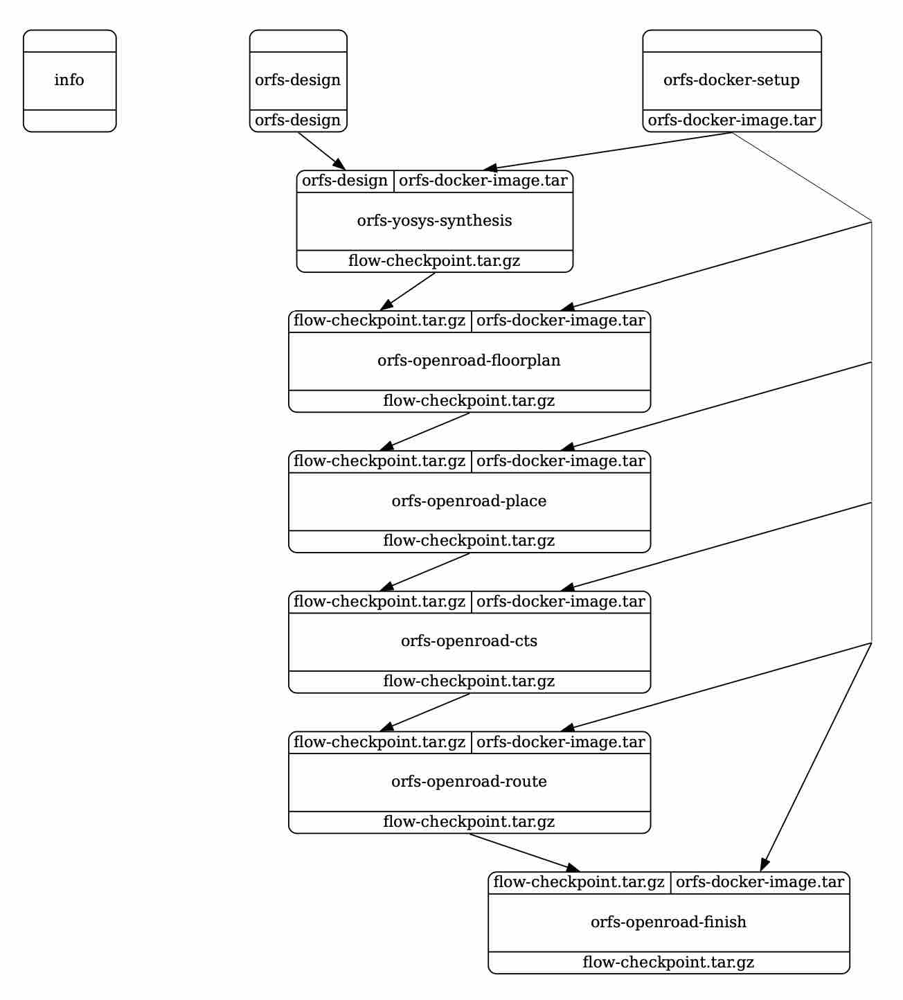
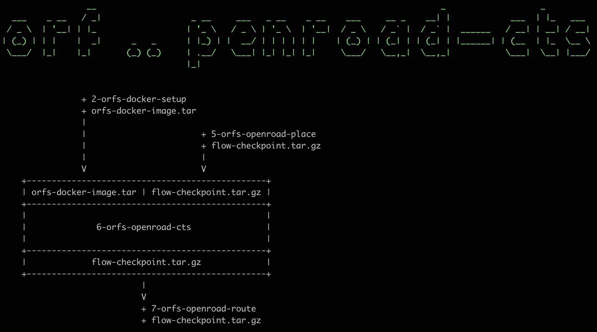
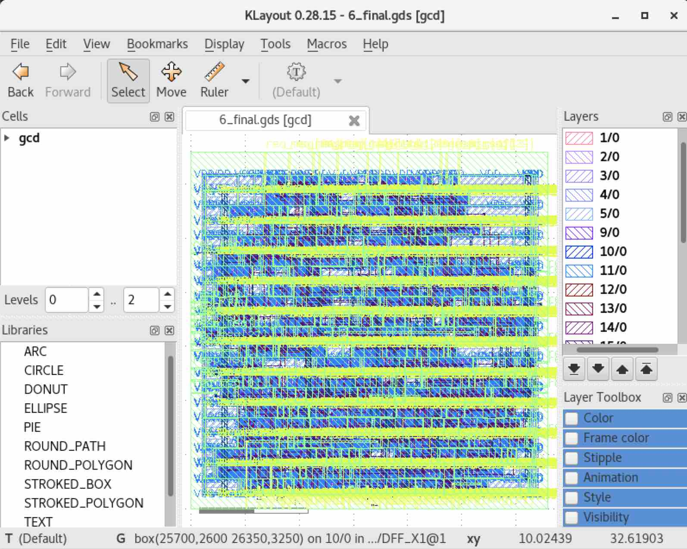

.. _openroad:

Integration with OpenROAD
==========================================================================

We are excited to partner with `the OpenROAD Project
<https://theopenroadproject.org>`__ and `the OpenROAD Flow Scripts
(ORFS) <https://github.com/The-OpenROAD-Project/OpenROAD-flow-scripts>`__
RTL-GDSII flow for rapid architecture and design space exploration, early
prediction of QoR, and detailed physical design implementation.

The mflowgen common library provides the following modular nodes in the
common library based on ORFS. They rely only on a working `Docker
<https://www.docker.com>`__ installation:

+-----------+-------------------------+------------------------------------------------------------------------------+
| **Tool**  | **Node**                | **Description**                                                              |
+-----------+-------------------------+------------------------------------------------------------------------------+
| Docker    | orfs-docker-setup       | Pulls an image from Docker hub containing the tools and environment for ORFS |
+-----------+-------------------------+------------------------------------------------------------------------------+
| Yosys     | orfs-yosys-synthesis    | Runs synthesis with the open-source Yosys tool to synthesize RTL into gates  |
+-----------+-------------------------+------------------------------------------------------------------------------+
| OpenROAD  | orfs-openroad-floorplan | Floorplans the die/core area, assigns pin placement, macro placement         |
+-----------+-------------------------+------------------------------------------------------------------------------+
| OpenROAD  | orfs-openroad-place     | Global placement with the open-source RePlAce tool and detailed placement    |
+-----------+-------------------------+------------------------------------------------------------------------------+
| OpenROAD  | orfs-openroad-cts       | Clock tree synthesis with the open-source TritonCTS tool                     |
+-----------+-------------------------+------------------------------------------------------------------------------+
| OpenROAD  | orfs-openroad-route     | Routing with the open-source FastRoute and TritonRoute tools                 |
+-----------+-------------------------+------------------------------------------------------------------------------+
| OpenROAD  | orfs-openroad-finish    | Finishing step with the open-source OpenRCX and other tools                  |
+-----------+-------------------------+------------------------------------------------------------------------------+

Refer to the `OpenROAD documentation <https://openroad.readthedocs.io>`__
for more information on the tools used in each stage of the flow.

To experiment with this flow, use the GcdUnit pipe cleaner as a demo:

.. code:: bash

    % cd $top
    % mkdir build-open && cd build-open
    % mflowgen run --design ../designs/GcdUnit/construct-open.py

You can then show the nodes present in this basic demo graph:

.. code:: bash

    % make status

     Status:

      - build -> 0  : info
      - build -> 1  : orfs-design
      - build -> 2  : orfs-docker-setup
      - build -> 3  : orfs-yosys-synthesis
      - build -> 4  : orfs-openroad-floorplan
      - build -> 5  : orfs-openroad-place
      - build -> 6  : orfs-openroad-cts
      - build -> 7  : orfs-openroad-route
      - build -> 8  : orfs-openroad-finish

You can also visualize the basic demo graph to inspect its connectivity:

.. code:: bash

    % make graph
    % ( ... open graph.pdf ... )

You can cross-check the ``construct-open.py``, the graph visualization, and
the `node configuration files
<https://github.com/mflowgen/mflowgen/tree/master/steps>`_ to see which
files are passing between which nodes.

At a high level, the flow relies on setting up a base docker image that
has the OpenROAD tool environment installed (``orfs-docker-setup``). The
base image is passed into each of the downstream nodes and used as a
vehicle for executing the tools. We host these base images on the mflowgen
Docker Hub with releases tagged with the date and the originating commit
of the ORFS repo.

- `mflowgen Docker Hub <https://hub.docker.com/repository/docker/mflowgen/openroad-flow-scripts-base/general>`_
- Example Tag: 2024-0621-f0caba6

Each node consumes and produces flow checkpoint tarballs, which are used
to initialize the state of the flow in a clean base docker container
before the node executes. There are no new docker images produced, which
makes this approach fast and clean, despite being a modular approach that
repeatedly goes in and out of docker containers.

The following information shows how you can inspect the inputs and outputs
of the ``orfs-openroad-cts`` node as an example:

.. code:: bash

    % make info-6  # Inspects the details for orfs-openroad-cts node

You can run the entire flow to the end:

.. code:: bash

    % make 8  # See "make status", corresponds to orfs-openroad-finish node

You can find the results in the outputs directory of the node,
specifically in the flow checkpoint tarball. You can also inspect the node
contents directly. For example,
``8-orfs-openroad-finish/flow/results/nangate45/gcd/base/6_final.gds`` has
the final layout:

Each node also supports debug targets to drop you into the Docker
container shell:

.. code::

    % make debug-8

    root@b11dbe7cd067:/OpenROAD-flow-scripts# ...

You can pass your own design into the flow by creating your own custom
``orfs-design`` node and connecting it to the synthesis node. See the
example provided in the `demo orfs-design node
<https://github.com/mflowgen/mflowgen/tree/master/designs/GcdUnit/orfs-design>`_
and see how it is used in the `demo graph
<https://github.com/mflowgen/mflowgen/tree/master/designs/GcdUnit/construct-open.py>`_
that you just ran. Refer to the OpenROAD Flow Scripts Documentation
`Adding New Designs
<https://openroad-flow-scripts.readthedocs.io/en/latest/user/AddingNewDesign.html>`_
for further details.

The integration of mflowgen with OpenROAD flow scripts opens the door for mflowgen
users to customize new functionality based on these open-source nodes.

