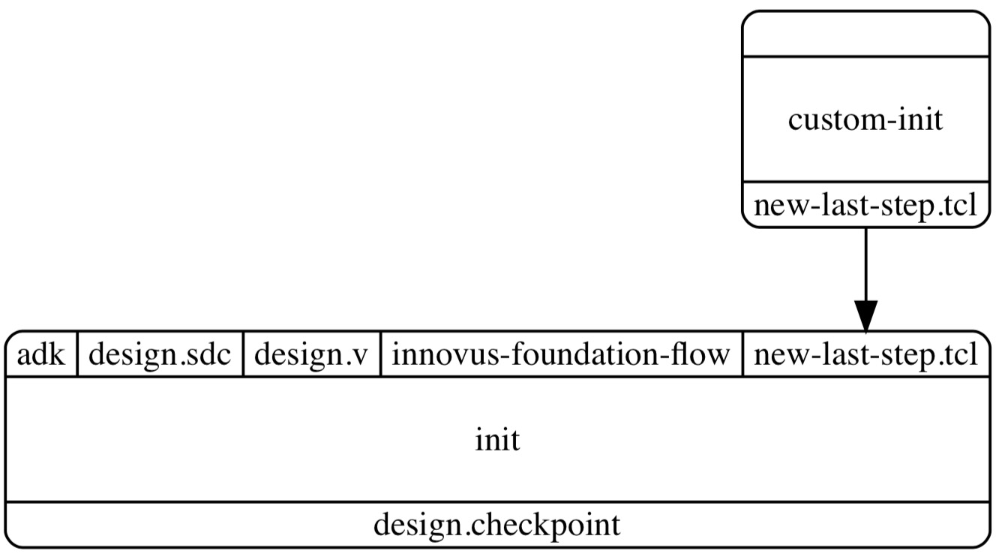

.. _innovus_submodularization:

Sub-Modular Node Design
==========================================================================

The mflowgen nodes we provide for DC synthesis and Innovus place-and-route
nodes are designed to be submodular. This means that each node (which is
already modular on its own) is further split into individual scripts for
various purposes (e.g., reporting, setting up variables and margins,
tweaking constraints). An mflowgen parameter called ``order`` then allows
the user to parameterize how the node is run from a Python interface. For
example, the user can remove a script that is not needed for their design,
add an additional custom script for their design, or simply define a
reordering of the existing scripts.

Take a look at the design initialization node (i.e.,
``cadence-innovus-init``), which is responsible for reading in the
post-synthesis design files from Synopsys DC and executing floorplanning.
This `node configuration file
<https://github.com/mflowgen/mflowgen/blob/master/steps/cadence-innovus-init/configure.yml>`__
lists the following inputs and outputs:

+--------+-------------------------+------------------------------------------------------------------------+
| input  | innovus-foundation-flow | Scripts generated by the Innovus Foundation Flow.                      |
+--------+-------------------------+------------------------------------------------------------------------+
| input  | adk                     | ASIC design kit interface to the process technology and library files. |
+--------+-------------------------+------------------------------------------------------------------------+
| input  | design.v                | The post-synthesis gate-level netlist.                                 |
+--------+-------------------------+------------------------------------------------------------------------+
| input  | design.sdc              | Constraints dumped from synthesis.                                     |
+--------+-------------------------+------------------------------------------------------------------------+
| output | design.checkpoint       | The working Innovus database after the node finishes.                  |
+--------+-------------------------+------------------------------------------------------------------------+

The configuration file also defines the ``order`` parameter, which lists
scripts in the following order (note that the contents of these scripts
can be found in the ``scripts`` subdirectory):

+----------------------+--------------------------------------------------------------------------------+
| main.tcl             | Main script from the Innovus Foundation Flow for design initialization.        |
+----------------------+--------------------------------------------------------------------------------+
| quality-of-life.tcl  | Useful variables and settings when working with Innovus.                       |
+----------------------+--------------------------------------------------------------------------------+
| floorplan.tcl        | Creates the floorplan with the core area and all margins.                      |
+----------------------+--------------------------------------------------------------------------------+
| pin-assignments.tcl  | Places IO pins along the perimeter of the design.                              |
+----------------------+--------------------------------------------------------------------------------+
| make-path-groups.tcl | Creates timing path groups to help the timing engine prioritize certain paths. |
+----------------------+--------------------------------------------------------------------------------+
| reporting.tcl        | Dumps a variety of reports.                                                    |
+----------------------+--------------------------------------------------------------------------------+

The order parameter determines the order in which the scripts are run. For
example, floorplanning (``floorplan.tcl``) will be executed after we read
in the design (``main.tcl``) and set up quality-of-life variables
(``quality-of-life.tcl``), with reporting done at the end of the node
(``reporting.tcl``). The order parameter can be accessed as a normal
python list in your mflowgen graph defined in construct.py. For example,
the parameter can be printed like this:

.. code:: python

    >>> init = Step( 'cadence-innovus-init', default=True )
    >>> order = init.get_param( 'order' )
    >>> print( order )
    ['main.tcl', 'quality-of-life.tcl', 'floorplan.tcl',
    'pin-assignments.tcl', 'make-path-groups.tcl', 'reporting.tcl']

The commands run Innovus with a special script that simply loops through
the order parameter and runs each item one by one. It searches for each
script in both the node's local ``scripts`` directory (for the default
versions of the scripts) as well as the ``inputs`` directory (where the
user can supply custom versions of the scripts) with priority given to the
inputs. This allows users to extend the node with new scripts.

.. note::

    If the same script is found in both the ``scripts`` and ``inputs``
    directories, priority is given to the copy in the inputs directory.

    For example, suppose that "scripts/foo.tcl" exists and the flow
    designer then supplies "inputs/foo.tcl". In this case,
    "inputs/foo.tcl" is run and "scripts/foo.tcl" is ignored.

For example, if we had a node called ``custom-init`` that provided
``new-last-step.tcl`` as an output, we could parameterize the init node to
append the new script at the end:

- main.tcl
- quality-of-life.tcl
- floorplan.tcl
- pin-assignments.tcl
- make-path-groups.tcl
- reporting.tcl
- **new-last-step.tcl** (a new custom script)

The mflowgen construct script would use the mflowgen API for extending the
list of inputs in a node (i.e., ``extend_inputs()``) and extend the init
node inputs with the list of all outputs of our custom node (i.e.,
``all_outputs()``). Running ``make graph`` would then produce a graph with
a new input edge into the init node like this:

The mflowgen construct script that does the above would look like this:

.. code:: python

    init        = Step( 'cadence-innovus-init', default=True )
    custom_init = Step( ... ) # Comes from somewhere and
                              # has an output 'new-last-step.tcl'

    init.extend_inputs( custom_init.all_outputs() )

    g.add_step( init )
    g.add_step( custom_init )
    g.connect_by_name( custom_init, init )

Finally, we would parameterize the order of the init node to include the
new input script:

.. code:: python

    order = init.get_param( 'order' )
    order.append( 'new-last-step.tcl' ) # Append the script to run last
    init.update_params( { 'order': order } )

    print( order ) # -> [ 'main.tcl', ..., 'new-last-step.tcl']

Note that we could simply have replaced the entire init node with our own
custom version. However, it can be very useful to reuse the majority of an
existing node while tweaking just a small part of it.

