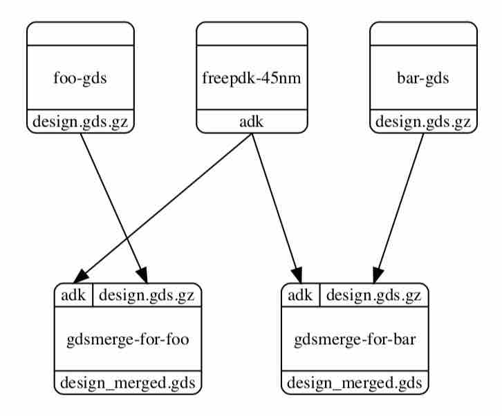

Instantiating a Node Multiple Times
==========================================================================

You can clone a node in your construct.py and instantiate it multiple
times in your graph.

For example, say you wanted a graph that looks like this, with the same
node (i.e., GDS merge) instantiated twice and two nodes feeding different
inputs to each (i.e., foo-gds and bar-gds):

You can use :py:mod:`Node.clone` to build this graph:

.. code::

    # This is the default node

    gdsmerge = Node( 'mentor-calibre-gdsmerge', default=True )

    # Clone the node however many times you need

    gdsmerge_for_foo = gdsmerge.clone()
    gdsmerge_for_bar = gdsmerge.clone()

    # Give them both new names

    gdsmerge_for_foo.set_name( 'gdsmerge-for-foo' )
    gdsmerge_for_bar.set_name( 'gdsmerge-for-bar' )

    # Add both nodes to the graph

    g.add_node( gdsmerge_for_foo )
    g.add_node( gdsmerge_for_bar )

    # Connect up both nodes

    g.connect_by_name( foo_gds, gdsmerge_for_foo )
    g.connect_by_name( bar_gds, gdsmerge_for_bar )

