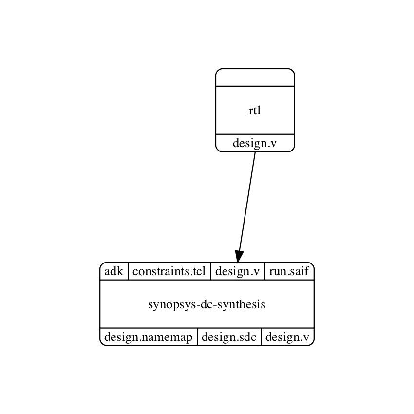
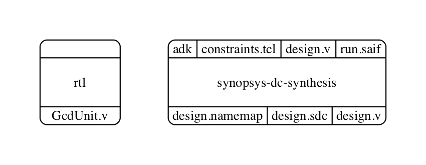
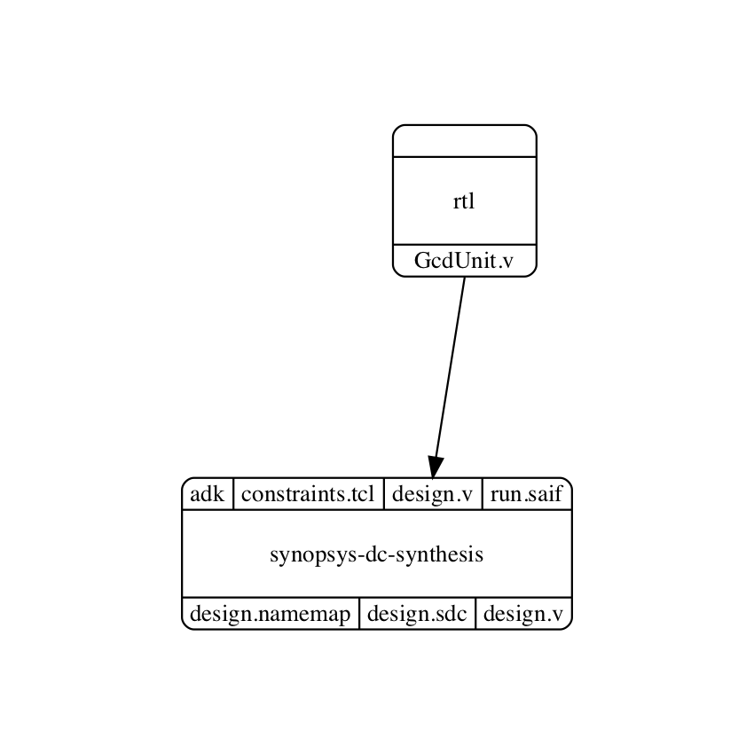

Connecting Nodes Together
==========================================================================

.. currentmodule:: mflowgen.components

There are two ways to connect two nodes in a graph (i.e., to draw edges
between nodes):

1. With :py:meth:`Graph.connect_by_name`

2. With :py:meth:`Graph.connect`, :py:meth:`Step.o`, and :py:meth:`Step.i`

:py:meth:`Graph.connect_by_name` tries to automatically connect outputs of
one node to inputs of the other node if the files have the same name.
Multiple edges can be drawn with a single call.

:py:meth:`Graph.connect` explicitly connects a single output of a node
(specified by :py:meth:`Step.o`) to a single input of another node
(specified by :py:meth:`Step.i`). Only a single edge is drawn.

Graph building is generally cleaner when connecting by name. The more
explicit connect API is useful when names do not match and it is
inconvenient to adjust node configurations to make them match.

Automatic Connection by Name
--------------------------------------------------------------------------

Here is a simple graph with two nodes, one for the design RTL and the
other which runs synthesis. We would like to connect the design RTL to the
synthesis node.

.. code:: python

    g = Graph()

    rtl = Step( ...  get rtl  ... )
    dc  = Step( ... get synth ... )

    g.add_step( rtl )
    g.add_step( dc  )

The RTL node has an output "design.v" and the synthesis node takes an
input "design.v". Since these names match, we can use
:py:meth:`Graph.connect_by_name` to simply connect these nodes with an
edge like this:

.. code:: python

      g.connect_by_name( rtl, dc )

We get this graph with automatic connection:

Explicit Connections
--------------------------------------------------------------------------

Here is another simple graph with the same two nodes for design RTL and
for synthesis. However, the names no longer match. We would still like to
make this connection.

We want to connect the RTL node's output "GcdUnit.v" to the synthesis
node's input "design.v". Since these names do not match, connecting by
name will not automatically draw any edges.

We can connect explicitly using :py:meth:`Graph.connect`,
:py:meth:`Step.o`, and :py:meth:`Step.i`:

.. code:: python

    g.connect( rtl.o( 'GcdUnit.v' ), dc.i( 'design.v' ) )

We can read this clearly: Connect **rtl output** "GcdUnit.v" to **dc
input** "design.v".

:py:meth:`Step.o` and :py:meth:`Step.i` are helper methods necessary for
differentiating outputs from inputs within a node. For example, the
synthesis node has an input file "design.v" (i.e., the RTL design) and
also an output file "design.v" (i.e., the synthesized netlist) with the
same name.

We get this graph with our explicit connection:

