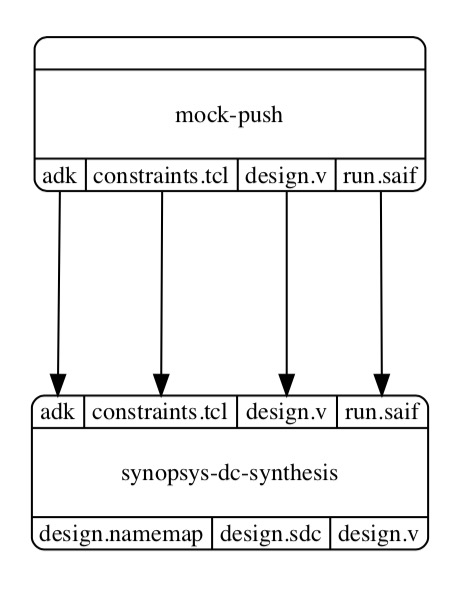
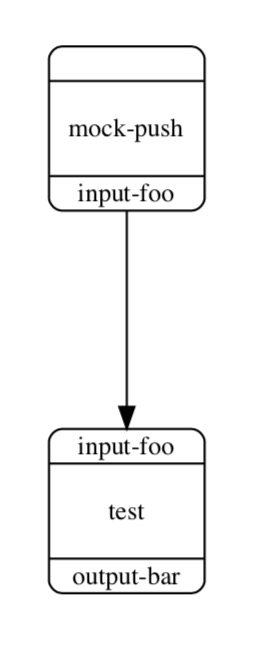

Mock Graphs for Modular Node Development
==========================================================================

Developing a node can be difficult when its inputs are generated as part
of a larger flow and you are not yet sure what the commands should be. In
this situation, it may not make sense to hook a partially developed node
into a full flow to debug the issues. Instead, you can tell mflowgen to
mock up a graph where you can provide inputs and test the node in
isolation.

The mock-up contains the "design-under-test" node and a "mock-push" node
that automatically provides placeholder outputs matching your node's
inputs. For example, the "synopsys-dc-synthesis" node in its mock-up graph
would look like this:

You could make sure your node works by spinning in a normal mflowgen
environment with full access to normal build targets (e.g., make status).
You would provide inputs and iterate on developing your node. You could
test the commands, the inputs and outputs, the preconditions and
postconditions, and the parameters before connecting it in a larger flow.

As an example, say we are developing and testing a new node "test" that
simply reads a file (i.e, "input-foo") and generates a file (i.e,
"output-bar"). Its node configuration file looks like this:

.. code:: yaml

    # test/configure.yml

    name: test

    inputs:
      - input-foo

    commands:
      - mkdir -p outputs
      - cat inputs/input-foo > outputs/output-bar

    outputs:
      - output-bar

You can tell mflowgen to mock up a graph for this node:

.. code::

    % ls
    test

    % mkdir build && cd build
    % mflowgen mock init --path ../test

The status and information reflects the tiny mock-up graph:

.. code::

    % make status

      Status:

       - build -> 0   : mock-push
       - build -> 1   : test

    % make info-1

         _                  _
        | |_    ___   ___  | |_
        | __|  / _ \ / __| | __|
        | |_  |  __/ \__ \ | |_
         \__|  \___| |___/  \__|

                  + 0-mock-push
                  + input-foo
                  |
                  V
            +------------+
            | input-foo  |
            +------------+
            |            |
            |   1-test   |
            |            |
            +------------+
            | output-bar |
            +------------+

Running the "make graph" target would generate this graph:

The mock files in "mock-push/outputs" can be replaced with real files. You
could then clean and re-run your node as you develop. Remember to pull
your changes back into the source copy of your node.

