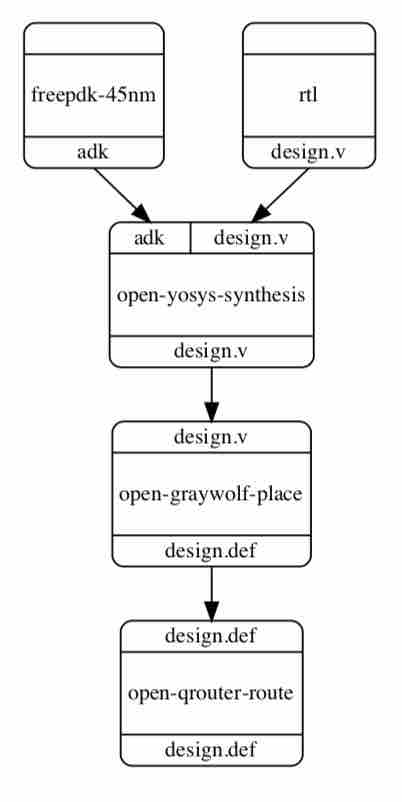
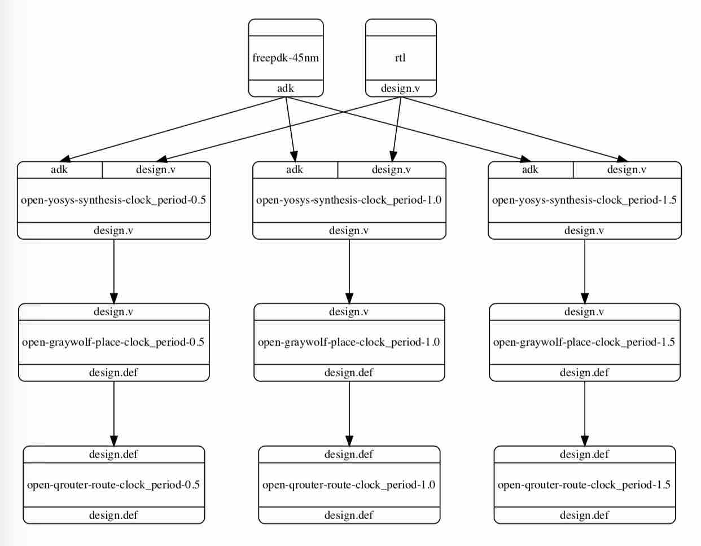
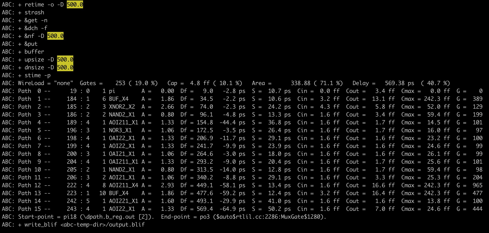

Sweeping Large Design Spaces
==========================================================================

.. In contrast to software, hardware design includes both logical
.. design-space exploration (i.e., architecture, RTL source code) and
.. physical design-space exploration (e.g., floorplanning and power
.. strategy). Physical design-space exploration can be uniquely
.. challenging because ASIC tools work extensively with files, making
.. an already challenging problem more difficult due to additional file
.. management for many slightly different builds.

Being embedded in a high-level language like Python allows mflowgen to
generate highly parameterized graphs to explore large design spaces in a
single graph. For example, we could sweep the design clock period to
quickly see where timing fails, or we could sweep the cross product of
a design space including combinational operators (e.g., add, mul, floating
ops), different bitwidths, different precision formats, and different
input datasets both for testing and for energy and timing estimation.

.. In a basic workflow, trying multiple values for a single parameter looks
.. like a user loop around the entire graph (i.e., multiple independent runs
.. configured and kicked off manually). Mflowgen provides the API to unroll
.. the loop into one big graph. For example, suppose we wanted to quickly
.. sweep the clock period parameter from 500 MHz to 800 MHz to see where
.. timing fails. Instead of manually instantiating the same graph multiple
.. times with tweaked clock periods ...

As a simple example, suppose we would like to sweep the `clock_period`
parameter in the `open-yosys-synthesis` step in this graph:

The mflowgen Python API :py:mod:`Graph.param_space` expands the node for
each parameter value in the list:

.. code:: python

    g = Graph()
    (... add steps and connect them together ... )
    g.param_space( 'open-yosys-synthesis', 'clock_period', [ 0.5, 1.0, 1.5 ] )

The expansion propagates to all downstream nodes, resulting in three
slightly different builds:

This essentially "unrolls the loop" within a single graph, allowing you to
more easily define and explore a parameter space, while avoiding manually
creating these spaces on your own. The three builds can be run in parallel
as usual (e.g., with "make -j" on different nodes), and all file
management is handled cleanly by the build system according to your
expanded graph.

.. note::

    If your graph updates parameters, please make sure to only run
    :py:mod:`Graph.param_space` *after* those calls.

    Specifically, all parameters (other than the target parameter) should
    already be defined. This is because :py:mod:`Graph.param_space`
    unrolls the loop across the parameter space for the *target* parameter
    (e.g., "clock_period") but uses the existing values for non-target
    parameters. It is difficult to adjust parameters after the loop has
    already been unrolled.

Note that parameters are passed as environment variables. This means that
parameter sweeping can be flexibly applied anywhere in the physical design
flow in a very simple manner:

1. Replace some code with a variable anywhere in your scripts
2. Identify this variable as a parameter (i.e., in the step's configure.yml)
3. Use the `param_space()` mflowgen API to perform a sweep of that variable

This support is useful for automating design-space exploration sweeps
involving one parameter or multiple parameters.

More Details
--------------------------------------------------------------------------

Here is a code example that sweeps the GcdUnit demo circuit across
different clock targets (0.5ns, 0.75ns, 1.0ns, 1.5ns) with the open-source
toolchain (yosys) and the 45nm standard cell library. Synthesis will fail
timing for the 0.5ns clock target.

Set up the mflowgen demo circuit:

.. code:: bash

    % mflowgen run --demo
    % cd mflowgen-demo
    % mkdir build && cd build

We switch to the open-source toolflow and add the clock period parameter sweep:

.. code:: bash

    % (edit "../GcdUnit/.mflowgen.yml" to point to "construct-open.py")
    % (edit "../GcdUnit/construct-open.py" to include the clock period parameter sweep)

      #-----------------------------------------------------------------------
      # Parameterize
      #-----------------------------------------------------------------------

      g.update_params( parameters )

      g.param_space( 'open-yosys-synthesis', 'clock_period', [0.5, 0.75, 1.0, 1.5] )

      return g

Then we run mflowgen and see the four synthesis targets with different clock
periods:

.. code:: bash

    % mflowgen run --design ../GcdUnit
    % make status
    (...)
     - build -> 3   : open-yosys-synthesis-clock_period-0.5
     - build -> 4   : open-yosys-synthesis-clock_period-0.75
     - build -> 5   : open-yosys-synthesis-clock_period-1.0
     - build -> 6   : open-yosys-synthesis-clock_period-1.5
    (...)

We build all of the yosys targets:

.. code:: bash

    % make 3 4 5 6 -j4

Here are the delays:

.. code:: bash

    % grep "Current delay" *yosys*/mflowgen-run.log

    4-open-yosys-synthesis-clock_period-0.75/mflowgen-run.log:ABC: Current delay (670.68 ps) does not exceed the target delay (750.00 ps). Upsizing is not performed.
    5-open-yosys-synthesis-clock_period-1.0/mflowgen-run.log:ABC: Current delay (670.68 ps) does not exceed the target delay (1000.00 ps). Upsizing is not performed.
    6-open-yosys-synthesis-clock_period-1.5/mflowgen-run.log:ABC: Current delay (670.68 ps) does not exceed the target delay (1500.00 ps). Upsizing is not performed.

The reports here show that the critical path delay through GcdUnit is
0.67ns, which meets timing for the 0.75ns, 1.0ns, and 1.5ns clock targets.
No upsizing is needed for any gates in these cases.

The 0.5ns clock period is not met. In this case, yosys-abc tries to upsize
gates and does better (0.569ns) but still does not meet timing.

.. code:: bash

    % less 3-open-yosys-synthesis-clock_period-0.5/mflowgen-run.log

This example sweep is not particularly complex and could easily be done
manually (e.g., if only a few points are needed). However, sweeping the
cross product of multiple parameters at once (e.g., architectural RTL
design parameters, bitwidths) quickly becomes cumbersome. In this case,
mflowgen parameter sweeps become more useful.

