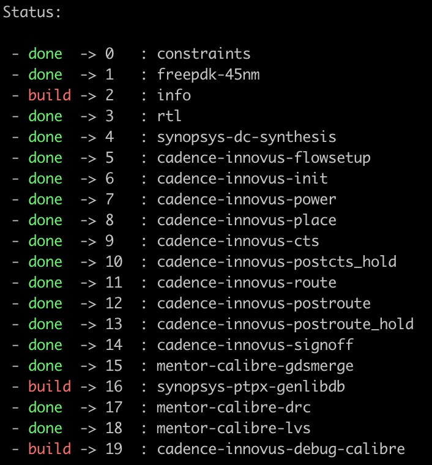
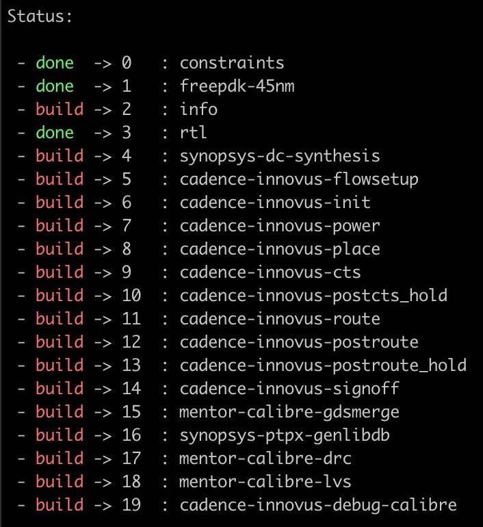
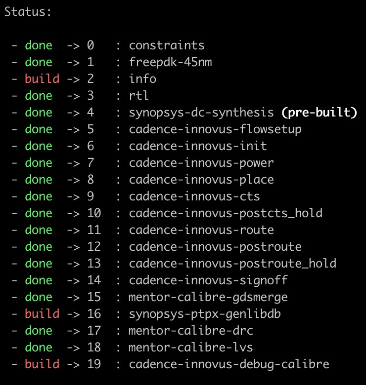
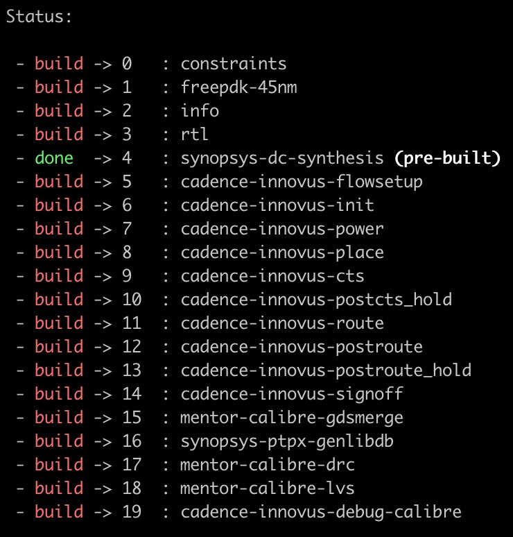

Stashing Pre-Built Steps for Sharing
==========================================================================

mflowgen supports stashing to help you share pre-built steps between people
working on the same graph.

For example, here is a "make status" printout for the GcdUnit design with
most steps already built:

At the command line, you can run "mflowgen stash help" to see help
messages on how to use stash commands.

We will walk through a simple example here. First you will choose a place
to put your stash:

.. code:: bash

    % mflowgen stash init --path /tmp
    Linked to stash: /tmp/2020-0316-mflowgen-stash-972c83

The stash contents are empty at the start:

.. code:: bash

    % mflowgen stash list

    Stash List

     - ( the stash is empty )

    Stash: /tmp/2020-0317-mflowgen-stash-588e56

We can stash our synthesis step with a message like this:

.. code:: bash

    % mflowgen stash push --step 4 -m "Pushing synthesis as a test"
    Stashed step 4 "synopsys-dc-synthesis" as author "ctorng"

.. note::

    Only the outputs of a step are stashed by default. Saving the outputs
    is often far smaller compared to saving the entire build of a step.
    You can use the optional ``--all`` flag to save an entire step,
    including all of its inputs, logs, and intermediate files. Note that
    this can be very slow if there are many small files to copy.

Now the stash contents show the pre-built synthesis step tagged with a
"4d1c23" hash:

.. code:: bash

    % mflowgen stash list

    Stash List

     - 4d1c23 [ 2020-0316 ] ctorng synopsys-dc-synthesis -- Pushing synthesis as a test

    Stash: /tmp/2020-0317-mflowgen-stash-588e56

You can stash other steps, and you can stash the same step multiple times
(they all get a different hash in the stash for uniqueness).

Now say we cleaned our copy of synthesis for whatever reason:

.. code:: bash

    % make clean-4   # Delete our copy of synthesis
    % make status

So everything from synthesis and onwards is marked not done. We can pull
the pre-built stashed copy like this:

.. code:: bash

    % mflowgen stash pull --hash 4d1c23
    Pulled step "synopsys-dc-synthesis" from stash into "4-synopsys-dc-synthesis"

    % make status

Synthesis is now back and it is marked "pre-built", meaning it is forced
always up-to-date until you remove it or run its clean target. Pulling
does **not** remove the step from the stash. You can pull the same stashed
step as many times as you want. Pulling will overwrite the existing step
of the same name in your current directory. You can also "stash pop" to
pull a pre-built step and then drop it from the stash.

.. note::

    The ``mflowgen stash`` commands mimic those from ``git stash``.
    However, mflowgen stashes are meant for sharing stashed copies with
    yourself and also with other users, while git stashes seem more
    intended for temporarily "shelving" your own versions for yourself to
    use.

It can be particularly useful for teams to share pre-built steps to enable
others to start from an intermediate point in a fresh build. For example,
we could stash pull on synthesis and continue onwards from there to do PnR
without re-executing any of the earlier steps in the flow.

First we link a build to a stash directory:

.. code:: bash

    # Some other person

    % cd build-x
    % mflowgen stash link --path /tmp/2020-0316-mflowgen-stash-972c83

Then we pull:

.. code:: bash

    % mflowgen stash pull --hash 4d1c23

    % make status

The upstream nodes are not built yet, but the pre-built synthesis step is
forced up-to-date (until cleaned). This means we can continue the flow
from this point and never worry about managing the pre-built copy or its
predecessors.

Also note that you can drop something from the stash like this:

.. code:: bash

    % mflowgen stash drop --hash 4d1c23
    Dropped step "synopsys-dc-synthesis" with hash "4d1c23"

As a final note, be aware that some steps *cannot* be shared if they
contain hardcoded paths, which may break when executed from another
location. Ideally, steps should be designed to be as portable as possible,
but this is not always feasible.

