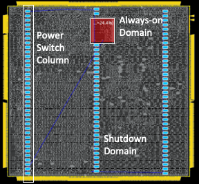
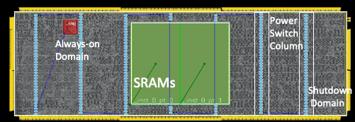

Static Checks
==========================================================================

**UNDER CONSTRUCTION**

mflowgen nodes are typically designed to be reused across different
designs, different technologies, or both. When a designer attempts to
reuse an mflowgen node, it is useful to have early and rapid feedback for
whether or not that node is being used properly in the new flow. However,
long CAD tool run times make *run-time* assertions insufficient for this
purpose, as designers would have to wait for the flow to reach the code
fragment of interest, which could take hours or even days.

mflowgen static checks are designed to provide early and rapid feedback on
whether or not a reusable mflowgen node is being reused properly by
running static program analysis at graph elaboration time to flag any
inconsistencies, instead of actually running the CAD tools.

Intent-Implementation Split
--------------------------------------------------------------------------

The intent-implementation split is one of mflowgen's built-in static
checks. Using the schema below, designers can separately express the
intent of a particular code fragment (along with formal properties
which any implementation of that intent must follow), from a potentially
design- or technology-specific implementation of that intent.

.. image:: _static/images/intent-impl-split-schema.pdf
  :width: 400px

Here is an example where the intent-implementation split is used to
add power domains to 2 different blocks while reusing the same
power domains insertion intent.

Specifically, this power domains strategy involves the creation of
an AON region within the block's floorplan. It is the same concept
regardless of which block it's placed in, but the AON region must
be placed carefully to avoid a variety of DRC and/or LVS errors.

Here is how a designer would write the intent block for drawing this
AON region. The intent runs the necessary tool command, accepts
parameters from an implementation as inputs, and contains a set of
properties that any implementation must obey.

.. code:: tcl

    proc mflowgen.intent.createAON { $aon_llx $aon_lly $aon_urx $aon_ury $x_gap $y_gap } {
      modifyPowerDomainAttr AON \
        -box $aon_llx $aon_lly $aon_urx $aon_ury  \
        -minGaps $aon_y_gap $aon_y_gap $aon_x_gap] $aon_x_gap]

      array set mflowgen.property.even_y {
        property "((aon_lly//y_pitch) % 2 == 0) & ((aon_ury//y_pitch) % 2 == 0)"
        describe "The AON region must begin and end on an even numbered
                 standard cell row to prevent obstructed power switches and
                 LUP DRCs"
      }

      array set mflowgen.property.max_width {
        property "(aon_urx - aon_llx) < horiz_switch_pitch)"
        describe "The always on region must be narrower than the pitch
                  between power switch pitches so that no more than 1 column
                  of switches is obstructed"
      }

      array set mflowgen.property.away_from_left_edge {
        property "aon_llx > (M3_str_offset + 2*M3_str_pitch)"
        describe "AON region must be far enough from left edge to allow space for at
                  least one set of M3 VDD/VSS stripes"
      }

      array set mflowgen.property.away_from_right_edge {
        property "aon_urx < (fp_width - M3_str_offset - 2*M3_str_pitch)"
        describe "AON region must be far enough from right edge to allow space for at
                  least one set of M3 VDD/VSS stripes"
      }

      array set mflowgen.property.M3_stripe_obstruction_left {
        property "math.fmod(aon_llx - M3_str_offset, M3_str_pitch) > (2 * M3_str_width)"
        describe "Left edge of AON region cannot overlap with M3 stripe"
      }

      array set mflowgen.property.M3_stripe_obstruction_right {
        property "math.fmod(aon_urx - M3_str_offset, M3_str_pitch) > (2 * M3_str_width)"
        describe "Right edge of AON region cannot overlap with M3 stripe"
      }
    }

An implementation must provide all of the inputs that the intent requires.
Here is an example implementation for creating the AON region in a given
block:

.. code:: tcl

    proc mflowgen.implement.createAON {} {
        # Params
        set x_offset   3
        set aon_width  14
        set aon_height 10
        set lly 50
        set minGap 1

        # Plase AON region in middle of tile (+ x_offset) on X-axis
        set aon_llx [expr $core_width/2 - $aon_width/2 + $x_offset]
        set aon_urx [expr $core_width/2 + $aon_width/2 + $x_offset]
        set aon_lly $lly
        set aon_ury [expr $aon_lly_coord + $aon_height]

        # Snap coords to placement grid
        set aon_llx_snap ...

        return [list $aon_llx_snap $aon_lly_snap $aon_urx_snap $aon_ury_snap $minGap $minGap]
    }

As you can see, this implementation provides values for all of the
parameters required by the createAON intent. Now that we have both
an implementation and an intent for this feature, we can run the
code fragment like this:

.. code:: tcl

    mflowgen.intent.createAON {*}[mflowgen.implement.createAON]

All of the parameter values are passed calculated by the implementation
are passed to the intent, and they are all checked for consistency
at *graph elaboration time*, not tool run time. This allows for immediate
feedback if a given implementation is incorrect and greatly shortens the
debug loop for any designer trying to reuse this code.

Here are two separate blocks that reused the same createAON intent, but
with different implementation blocks.

